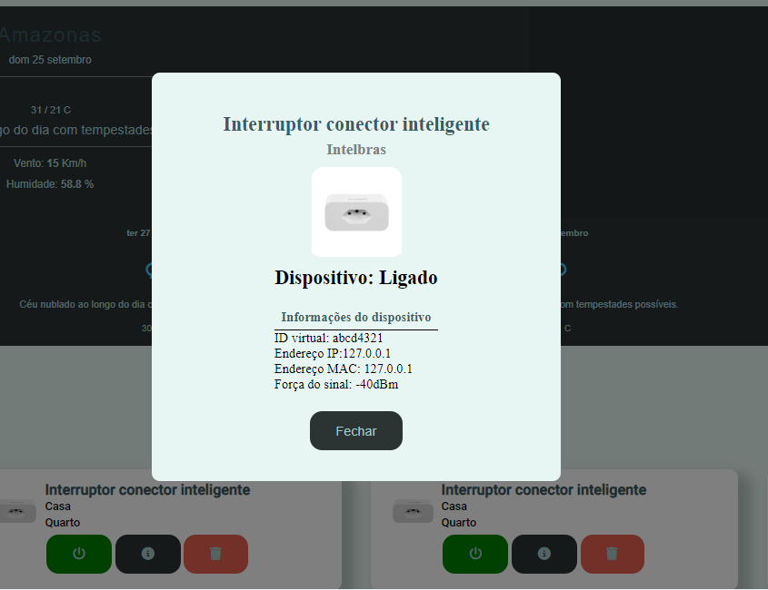
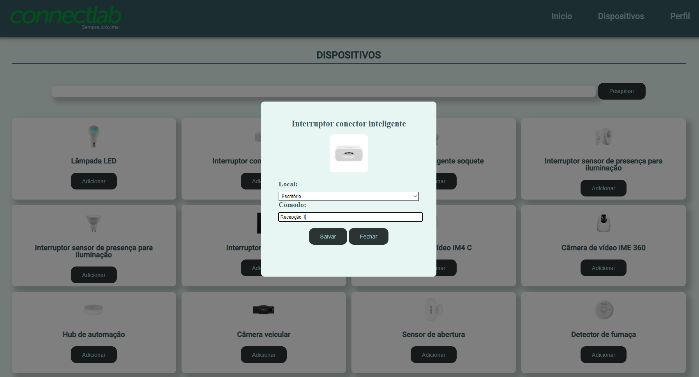
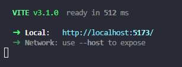

<div id="container" style="height:100px;line-height:100px;">

</div>

<p align="center">
 <h2 align="center">Connect Lab - Dashboard para gerenciar dispositivos IOT</h2>
 <p align="center">Projeto feito para conclusão de módulo front-end do curso DEVinHouse (Turma Intelbras)</p>
 <p align="center">hospedado em: <a href="https://connect-lab-mvsn.netlify.app/">Netlify</a> </p>
</p>
  <p align="center">
    <a href="">
      
    </a>
    <a href="">
      
    </a>
    <a href="">
      
    </a>    
    <a href="">
      
    </a> 
    <a href="">
      
    </a>
  </p>

## Features

- Cadastro/Login ( Com validações )
- Adição/Remoção de Dispositivos a conta
- Gerenciar Estado dos dispositivos
- Sistema de notificações via Toast
- Previsão do tempo baseado no local do usuário
- Todas as comunicações/ações feitas em comunicação via API

### A ser desenvolvido

Melhorias que poderão ser feitas no projeto posteriormente.

- [ ] Dark/Light Mode
- [ ] Cadastro de novos dispositivos

### Imagens do projeto

<p align="center">
 <h2 align="center">Página de inicio da aplicação</h2>
 <p>Página responsável por visão geral dos dispositivos adicionados a conta e gerenciamento dos mesmos, podendo ser possível desliga-los/liga-los ver detalhes dos mesmos e também fazer a exclusão do dispositivo vinculado a conta. </p>
</p>

<div id="container" style="height:100px;line-height:100px;">

</div>

<p align="center">
 <h2 align="center">Modal com detalhes de cada dispositivo</h2>
</p>

<div id="container" style="height:100px;line-height:100px;">

</div>

<p align="center">
 <h2 align="center">Página de adição de dispositivos</h2>
 <p>Página responsável por vincular um dispositivo a conta de um usuário</p>
</p>

<div id="container" style="height:100px;line-height:100px;">

</div>

## Rodando projeto localmente

Clonar repositório / entrar na pasta do projeto / Instalar as dependencias do projeto

```
https://github.com/Matheusvicentesn/connect-lab
```

```
cd connect-lab
```

```
npm install
```

Executa o aplicativo no modo de desenvolvedor

```
npm run dev
```

Em seguida já é possível acessar a página localmente através do endereço que vai ser gerado no terminal


### Contato

Projeto desenvolvido com base na atividade do curso DEVinHouse
Qualquer dúvida ou sugestão estou disponível no e-mail:
<a href="mailto:contato@matheusvicente.dev.br?subject=Questions" title=""> contato@matheusvicente.dev.br</a>
